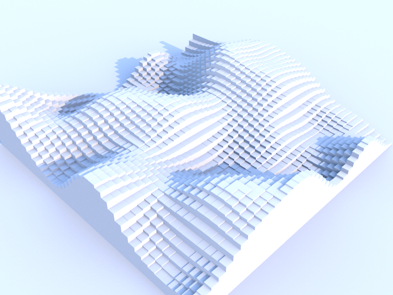

#threeflow.js : A Sunflow Renderer for three.js

### Overview

To come..

### Installation

Installation via npm. Will run a local socket server that projects can connect to..
```shell
# npm package to come..
```

------------------------------------------------------------------------------
#### Quick Render Examples

*1. Perlin noise scaled THREE.CubeGeometry with Sunflow Sunsky Light*


*2. Json loaded Camaro model with THREEFLOW.ShinyMaterial & THREEFLOW.MirrorMaterial*


*3. WIP - working on THREE.MorphAnimMesh & THREE.FaceColors support*


------------------------------------------------------------------------------

### Usage
To come..

**coffescript example:**
```coffee
# create an instance of the renderer
# along with some render output paths

renderer = new THREEFLOW.SunflowRenderer
  pngPath: "renders/myRender.png"

# connect to the socket server.
renderer.connect()

# to render a three.js scene:
renderer.render scene,camera,width,height

```

### Examples
[Example source can be found here](src/examples)

### Materials
[Material documentation found here](src/client/materials)

### Lights
[Lights documentation found here](src/client/lights)

### References

The majority of the information on Sunflow can be found in the Sunflow Wiki.
To better understand the full .sc file parser, the source code for the parser can be
found in the ScParser.java file in the source.

**Sunflow Site**

+ http://sunflow.sourceforge.net/

**Sunflow Wiki**

+ http://www.geneome.com/sunflow-wiki/
+ http://geneome.com/sunflow/sfwiki.pdf

**Sunflow Source**

+ https://github.com/fpsunflower/sunflow
+ https://github.com/fpsunflower/sunflow/blob/master/src/org/sunflow/core/parser/SCParser.java

**Sunflow Misc**

+ http://home.comcast.net/~gamma-ray/sf/sunflow-faq.htm


------------------------------------------------------------------------------


