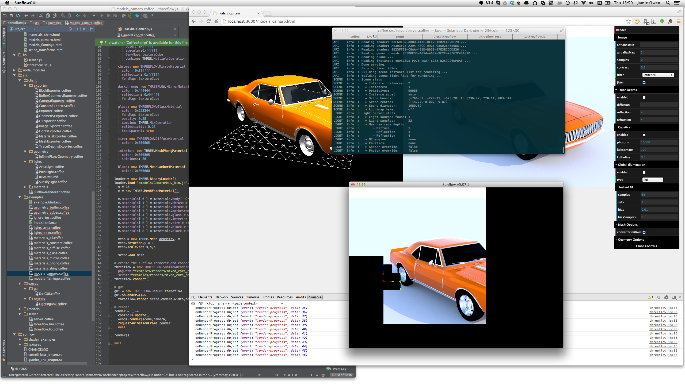
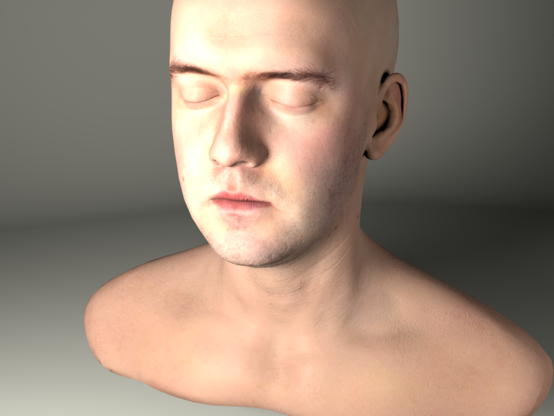
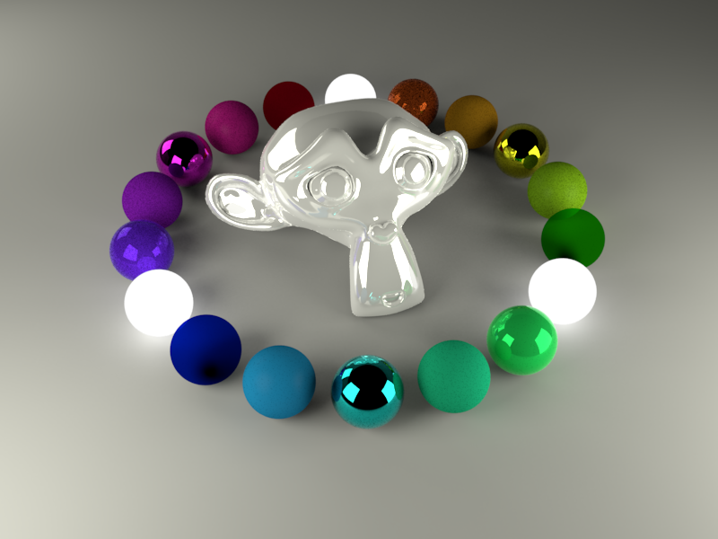

#threeflow.js : sunflow for three.js

###version 0.6.0-4 - beta

###Overview

Threeflow lets you render [three.js](http://threejs.org/) scenes with the [sunflow rendering engine](http://sunflow.sourceforge.net/).  If you don't know what sunflow is - it's an open source 3d ray tracer written in java for creating photo-realistic images, and used quite a lot with other languages like [processing](http://processing.org/) and [structure synth](http://structuresynth.sourceforge.net/).

Threeflow converts a three.js scene into the sunflow scene file format and passes it via a socket server to be rendered on your local machine.

It gives support of THREE.Mesh instances using THREE.Geometry or THREE.BufferGeometry data.  And exports face normals and uv vertex data, letting you render textures and bump maps as well.

Materials in three.js will be mapped to predefined sunflow materials, but it's recommended you use the threeflow materials for now. See the examples for more info.

Also there is a lighting rig object that sets up 4 THREEFLOW.AreaLights with transform controls and target points. Saving you the headache of setting this up and letting you concentrate on generating
geometry and assigning materials.

You can customize the render and lighting rig settings with a gui built with [dat.gui](https://code.google.com/p/dat-gui/)


###Installation

Make sure you have [java](https://www.java.com) and [npm/node](http://nodejs.org/) installed; then run the npm install command with the -g option:
```shell
npm install -g threeflow
```

Threeflow needs to render images and scene files into a folder on your hard drive. It also needs a static folder to deliver via its local http server. This is setup for you with the init command.

Create a new folder, and from inside that folder run:
```shell
threeflow init
```
This should setup a project folder, copying examples for editing and creating render folders. See below for more info on project structure.

To start the server and start rendering run:
```shell
threeflow start
```
Then in the browser connect to: http://localhost:3710

------------------------------------------------------------------------------
#### Screenshot


------------------------------------------------------------------------------
#### Renders

Camaro / Face Materials


Lee Perry Smith / Textures and Bump maps.


Suzanne / Materials



------------------------------------------------------------------------------

### Usage
Check the examples for setup but the most basic setup looks like this:

```javascript
<!-- Include socket.io !-->
<script src="/socket.io/socket.io.js"></script>

<!-- Dat gui if you are using the gui !-->
<script src="js/dat.gui.js"></script>

<!-- three.js and threeflow.js !-->
<script src="js/three.js"></script>
<script src="js/threeflow.js"></script>

<!-- These extras are required by the lighting rig - also get the version of TransformControls from the threeflow repository as it contains some changes.. !-->
<script src="js/OrbitControls.js"></script>
<script src="js/TransformControls.js"></script>

<script>

  var width, height;
  var threeflow, lighting, gui;
  var camera, scene, renderer;

  init();
  update();

  function init() {

    // three/threeflow setup.

    width = 800; height = 600;

    threeflow = new THREEFLOW.SunflowRenderer();
    threeflow.setSize( width,height );

    renderer = new THREE.WebGLRenderer();
    renderer.setSize( width,height );

    document.body.appendChild( renderer.domElement );

    scene = new THREE.Scene();

    camera = new THREE.PerspectiveCamera( 35, width/height, 1, 10000 );
    camera.position.z = 1000;

    lighting = new THREEFLOW.LightingRig(camera,renderer.domElement);
    lighting.loadState('<JSON OBJECT HERE> (dumped to console from threeflow gui)');

    scene.add( lighting );

    gui = new THREEFLOW.Gui(threeflow,lighting);

    gui.onRender.add( function(){
      threeflow.render( scene, camera, "render-image-name" );
    });


    // scene objects

    var geometry,material,mesh;

    geometry = new THREE.BoxGeometry(50,50,50);
    material = new THREEFLOW.ShinyMaterial({color:0xFF0000,reflection:0.5});
    mesh = new THREE.Mesh( geometry, material );

    scene.add( mesh );

  }

  function update() {
    requestAnimationFrame( update );

    lighting.update();
    renderer.render( scene, camera );
  }

</script>

```

###Rendering
Getting use to all the settings and rendering high-quality images is one big art in itself.
Check the [sunflow wiki](http://www.geneome.com/sunflow-wiki/) for this. Or read about renderers in software like Maya,Cinema 4d or 3dsMax.

Here's some rough ideas:

+ Use IPR Render button in the gui for quick preview
+ Use Render button for final renders.
+ Set Image > antialiasMin=1, antialiasMax=2 and a mitchell/gaussian filter for final renders.
+ Override light samples easily to soften shadows via the Later/Other > Overrides folder.
+ Final Gathering gives really nice results, but thats a monster of a tutorial.

Other than this, just play around.

###Lighting Rig
This gives you 4 THREEFLOW.AreaLights arranged around target points that are configured and saved via the gui. It is modelled on [3 or 4 point lighting](http://en.wikipedia.org/wiki/Three-point_lighting) methods in film and photography.

The lights and target points are interactive using the THREE.TransformControls class. The light can have its scale and position modified and is always facing the target point. The target point can have only its position modified.

When adjusting the radiance of lights via the gui you will not see any changes in three.js except with the key light.  This was intentional as it was turning into one big mission roughly matching up lighting from three.js to sunflow.
That will be added later, so for now, either use your imagination intensely or just hit the IPR render button for a quick preview.

###Project structure
If you have an existing project you can intialise it without running 'threeflow init' by creating a threeflow.json file in the root folder.
The threeflow.json file defines a static/deploy folder that will be served and lets you customize render folders.

Create one of these and configure the options. Make sure to copy over [dependencies](templates/default/deploy/js).

Then run 'threeflow start' as usual.

```json
{
  "server": {
    "port": 3710,
    "static":"/deploy"
  },

  "folders": {
    "renders":"/deploy/renders"
  }
}
```

###Geometry Caching
It can take a few seconds to build the scene file source for large geometries and this gets annoying when you are constantly previewing renders.
So threeflow caches geometry scene file source after it first creates it. If you are making changes to the geometry in between each render set a property on the geometry object to prevent this:

```javascript
geometry._tf_noCache = true;
```

###Excluding Meshes
Threeflow excludes unsupported meshes by default but if you want to exclude other meshes from being rendered you have two options.

To exclude the mesh altogether use:
```javascript
mesh._tf_noIndex = true;
```

To include the mesh but not its children use
```javascript
mesh._tf_noTraverse = true;
```

### Materials
[Old Material documentation found here](src/client/materials)

### Lights
[Old Lights documentation found here](src/client/lights)


### Roadmap
#### 0.6.2
+ Material assignment alternative.
+ Ambient Occlusion Material
+ Ward Material
+ Other Cameras ( DOF/Bokeh/Spherical )
+ Other Lights ( Directional, Spherical, Fisheye )
+ AO / Gray / Overrides

#### 0.6.3
+ Low to High Geometry Mapping
+ Texture Baking
+ Normal Map Modifier
+ Perlin Noise Modifier

#### 0.6.4
+ Janino Materials
+ THREE.Line support
+ Sunflow primitives.

### References

The majority of the information on Sunflow can be found in the Sunflow Wiki.
To better understand the full .sc file parser, the source code for the parser can be
found in the ScParser.java file in the source.

**Sunflow Site**

+ http://sunflow.sourceforge.net/

**Sunflow Wiki**

+ http://www.geneome.com/sunflow-wiki/
+ http://geneome.com/sunflow/sfwiki.pdf

**Sunflow Source**

+ https://github.com/fpsunflower/sunflow
+ https://github.com/fpsunflower/sunflow/blob/master/src/org/sunflow/core/parser/SCParser.java

**Sunflow Misc**

+ http://home.comcast.net/~gamma-ray/sf/sunflow-faq.htm


------------------------------------------------------------------------------