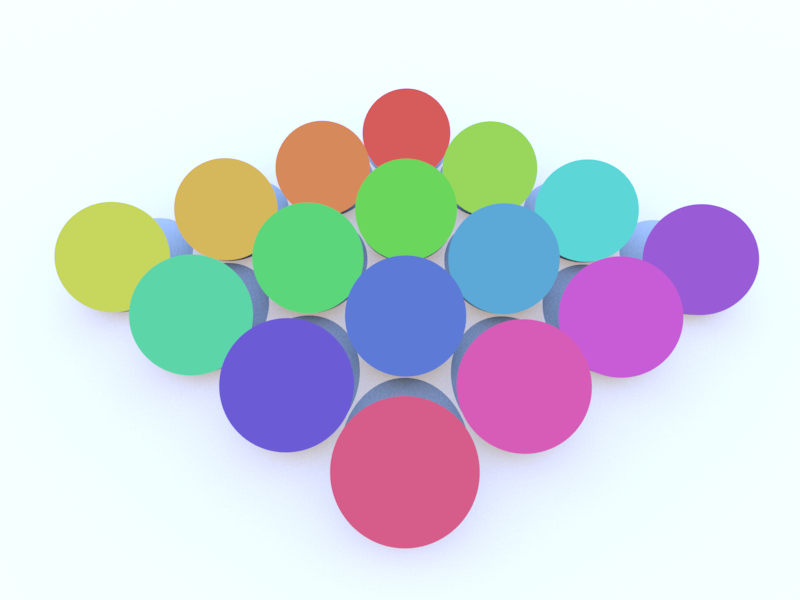
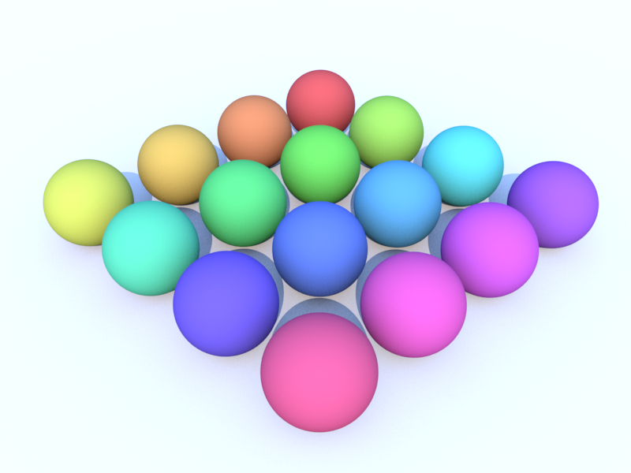
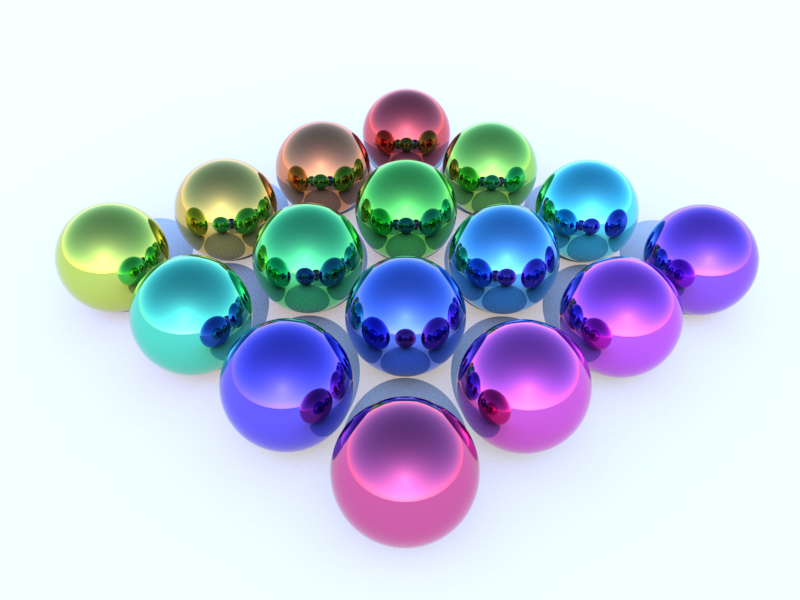

# Materials

## Basics


Info to come..

## Constant Material


```coffee
material = new THREEFLOW.ConstantMaterial
  color: 0xff0000

geometry = new THREE.SphereGeometry()
mesh     = new THREE.Mesh geometry,material

scene.add mesh
```


## Diffuse Material


```coffee
material = new THREEFLOW.DiffuseMaterial
  color: 0xff0000

geometry = new THREE.SphereGeometry()
mesh     = new THREE.Mesh geometry,material

scene.add mesh
```

## Phong Material

*need to render this again*

```coffee
material = new THREEFLOW.PhongMaterial
  color: 0xff0000
  specular: 0xffffff
  samples: 4
  power: 50

geometry = new THREE.SphereGeometry()
mesh     = new THREE.Mesh geometry,material

scene.add mesh
```

## Shiny Material


```coffee
material = new THREEFLOW.ShinyMaterial
  color: 0xff0000
  reflection: 0.5

geometry = new THREE.SphereGeometry()
mesh     = new THREE.Mesh geometry,material

scene.add mesh
```

## Glass Material


```coffee
material = new THREEFLOW.GlassMaterial
  color: 0xff0000
  eta: 1.33

geometry = new THREE.SphereGeometry()
mesh     = new THREE.Mesh geometry,material

scene.add mesh
```

## Mirror Material


```coffee
material = new THREEFLOW.MirrorMaterial
  color: 0xff0000
  reflection: 0xffffff

geometry = new THREE.SphereGeometry()
mesh     = new THREE.Mesh geometry,material

scene.add mesh
```

