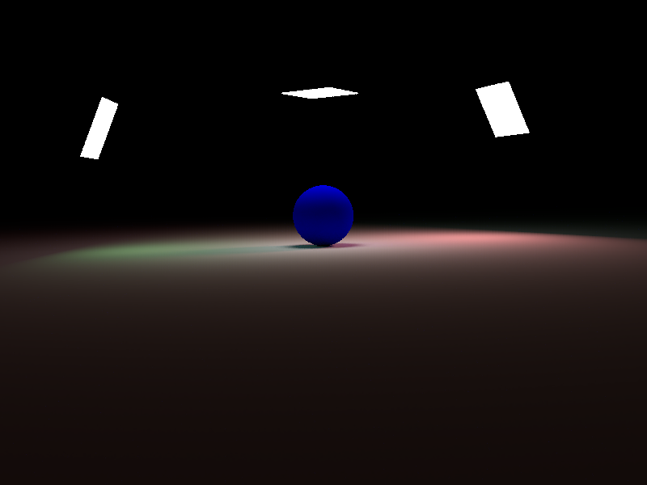

# Lights

Markers and Simulate Options.

## Point Light


```coffee
light = new THREEFLOW.PointLight
  color: 0xff0000
  power: 300
  simulate: true

scene.add light
```

## Area Light


```coffee
# custom geometry
lightGeometry = new THREE.PlaneGeometry 300,300,2,2

light = new THREEFLOW.AreaLight
  color: 0xff0000
  radiance: 20
  simulate: false
  geometry: lightGeometry

scene.add light
```

