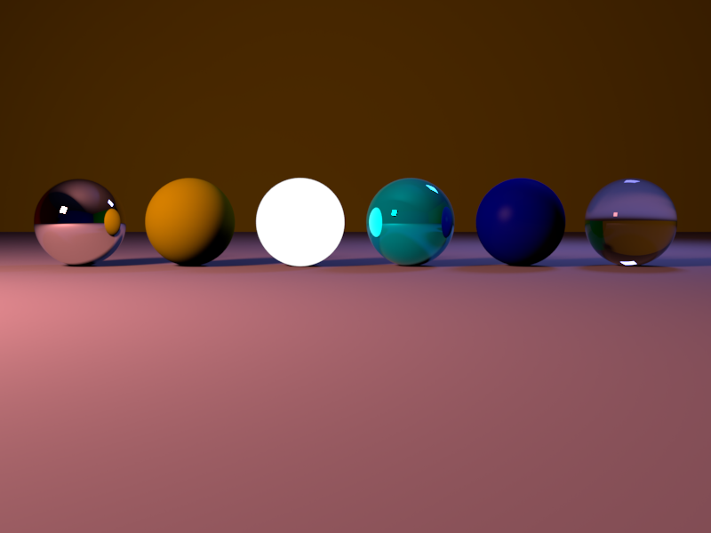
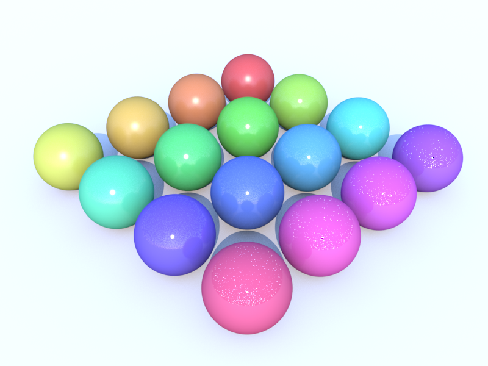
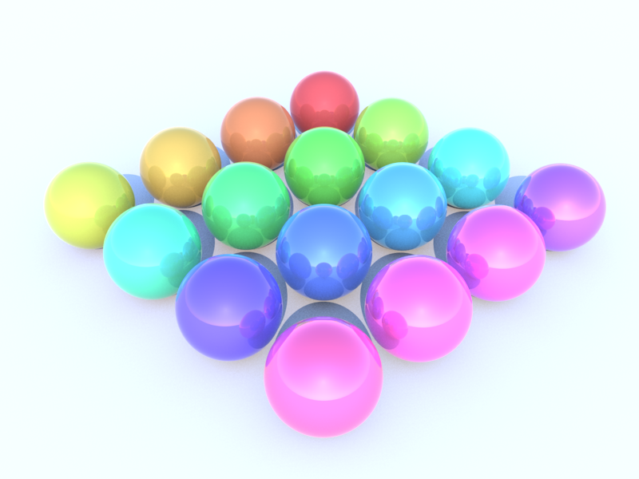

# Materials

## Basics


Info to come..

## Constant Material


*Coffeescript*
```coffee
material = new THREEFLOW.ConstantMaterial
  color: 0xff0000

geometry = new THREE.SphereGeometry()
mesh     = new THREE.Mesh geometry,material

scene.add mesh
```

*Javascript*
```javascript
material = new THREEFLOW.ConstantMaterial(
  { color: 0xff0000 } );

geometry = new THREE.SphereGeometry();
mesh     = new THREE.Mesh(geometry,material);

scene.add(mesh);
```

Aside from being used as a flat shader, the constant shader can also be used to fake lighting when path tracing is
used by increasing the value of the color beyond 1.0.

## Diffuse Material


```coffee
material = new THREEFLOW.DiffuseMaterial
  color: 0xff0000

geometry = new THREE.SphereGeometry()
mesh     = new THREE.Mesh geometry,material

scene.add mesh
```

## Phong Material

*need to render this again*

```coffee
material = new THREEFLOW.PhongMaterial
  color: 0xff0000
  specular: 0xffffff
  samples: 4
  power: 50

geometry = new THREE.SphereGeometry()
mesh     = new THREE.Mesh geometry,material

scene.add mesh
```
The number after the spec color values is the "power" or hardness of the specularity. You can crank it pretty high
(e.g. 50000), so start with low values like 50 and work you're way up or down from there. If you set the samples
to 0, you'll turn off the indirect glossy reflections. If you set the samples to anything greater than 1, you'll get blurry
reflections (with higher samples giving better reflections).


## Shiny Material


```coffee
material = new THREEFLOW.ShinyMaterial
  color: 0xff0000
  reflection: 0.5

geometry = new THREE.SphereGeometry()
mesh     = new THREE.Mesh geometry,material

scene.add mesh
```

## Glass Material


```coffee
material = new THREEFLOW.GlassMaterial
  color: 0xff0000
  eta: 1.33

geometry = new THREE.SphereGeometry()
mesh     = new THREE.Mesh geometry,material

scene.add mesh
```

## Mirror Material


```coffee
material = new THREEFLOW.MirrorMaterial
  color: 0xff0000
  reflection: 0xffffff

geometry = new THREE.SphereGeometry()
mesh     = new THREE.Mesh geometry,material

scene.add mesh
```

